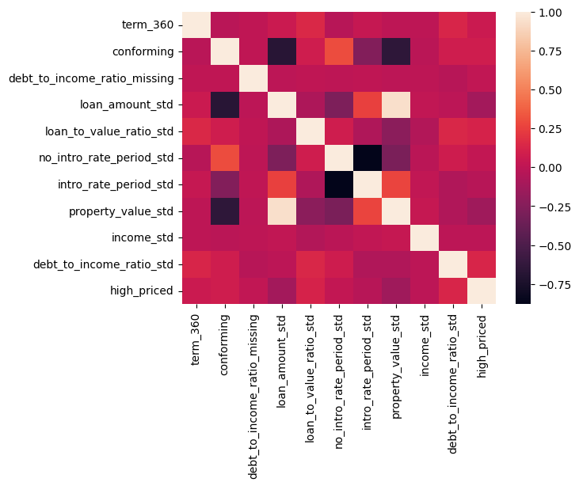
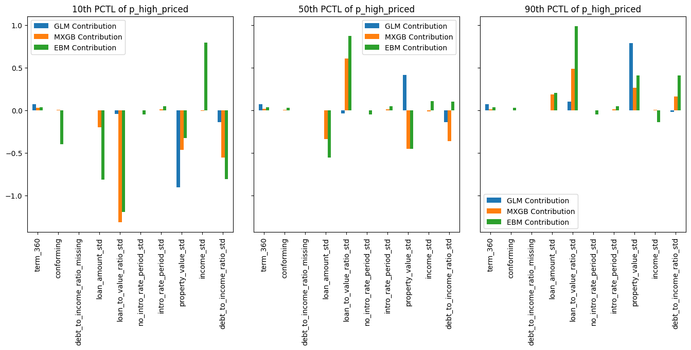
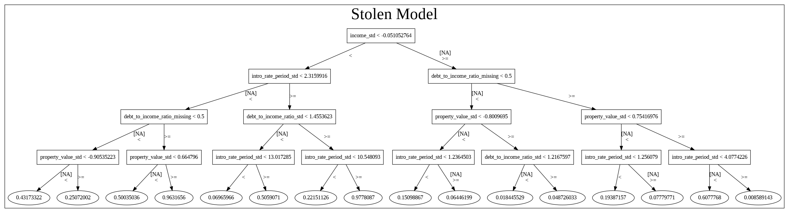
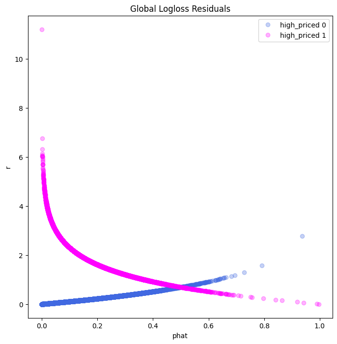

# Remediated Home Loan Approval Model

### Basic Information

* **Developer**: Nick Whims, `whimsnick@gmail.com`
* **Model date**: April, 2025
* **Model version**: 1.0
* **Model License**: MIT
* **Model implementation code**: [DNSC_6330_loan_model.ipynb](https://github.com/nwhims/DNSC_6330/blob/main/DNSC_6330_loan_model.ipynb)

### Intended Use
* **Primary intended uses**: This model is a probability of default classifier, with an intended use case for determining eligibility for a hoem loan.
* **Primary intended users**: Home loan providers.
* **Out-of-scope use cases**: Any use beyond an educational example is out-of-scope.

### Training Data

* Data dictionary: 

| Name | Modeling Role | Measurement Level| Description|
| ---- | ------------- | ---------------- | ---------- |
|**term_360**| input | int | whether the mortgage is a standard 360 month mortgage (1) or a different type of mortgage (0) |
| **property_value_std** | input | float | value of the mortgaged property |
| **no_intro_rate_period_std** | input | int | whether (1) or not (0) a mortgage does not include an introductory rate period
| **loan_to_value_ratio_std** | input | float | ratio of the mortgage size to the value of the property for mortgage applicants |
| **intro_rate_period_std** | input | float | standardized introductory rate period for mortgage applicants |
| **loan_amount_std** | input | float | standardized amount of the mortgage for applicants |
| **income_std** | input | float | standardized income for mortgage applicants. |
| **debt_to_income_ratio_missing** | input | int | missing marker (1) for debt_to_income_ratio_std |
| **debt_to_income_ratio_std** | input | float | standardized debt-to-income ratio for mortgage applicants |
| **conforming** | input | int | whether the mortgage conforms to normal standards (1), or whether the loan is different (0), e.g., jumbo, HELOC, reverse mortgage, etc. |
| **high_priced**| target | int | the annual percentage rate (APR) charged for a mortgage is 150 basis points (1.5%) or more above a survey-based estimate of similar mortgages; (1) = yes, (2) = no |

* **Source of training data**: Home Mortgage Disclosure Act (HMDA)
* **How training data was divided into training and validation data**: 62% training, 27% validation, 11% test
* **Number of rows in training and validation data**:
  * Training rows: 112,237
  * Validation rows: 48,101

### Evaluation Data
* **Source of test data**: Home Mortgage Disclosure Act (HMDA)
* **Number of rows in test data**: 19,831
* **State any differences in columns between training and test data**: None

### Model Details
* **Columns used as inputs in the final model**: 'property_value_std', 'intro_rate_period_std', 'no_intro_rate_period_std', 'debt_to_income_ratio_missing', 'debt_to_income_ratio_std', 'income_std'
* **Column(s) used as target(s) in the final model**: 'high_priced'
* **Type of model**: EBM
* **Software used to implement the model**: Python, xgboost
* **Version of the modeling software**: 2.1.4
* **Hyperparameters or other settings of your model**: 
```
rem_params = {'max_bins': 256,
              'max_interaction_bins': 64,
              'interactions': 10,
              'outer_bags': 8,
              'inner_bags': 4,
              'learning_rate': 0.05,
              'validation_size': 0.25,
              'min_samples_leaf': 2,
              'max_leaves': 5,
              'n_jobs': 4,
              'early_stopping_rounds': 100,
              'random_state': 3463}
```
### Quantitative Analysis

* Models were assessed primarily with AUC and AIR. See details below:

| Train AUC | Validation AUC | Test AUC |
| ------ | ------- | -------- |
| 0.7538 | 0.7848  | 0.774 |

Table 1. AUC values across data partitions. 

| Group | Validation AIR |
|-------|-----|
| Black vs. White | 0.809 |
| Asian vs. White | 1.155 |
| Female vs. Male | 0.958 |

Table 2. Validation AIR values for race and sex groups. 



Figure 1. Correlation heatmap for input features. 



Figure 2. Local feature importance across models.



Figure 3. Extracted representation of the derived model.



Figure 4. A plot of the predictive residuals on a log scale.

### Ethical Considerations

